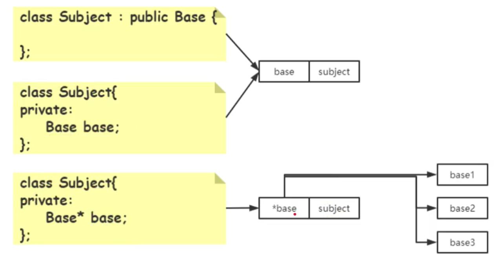
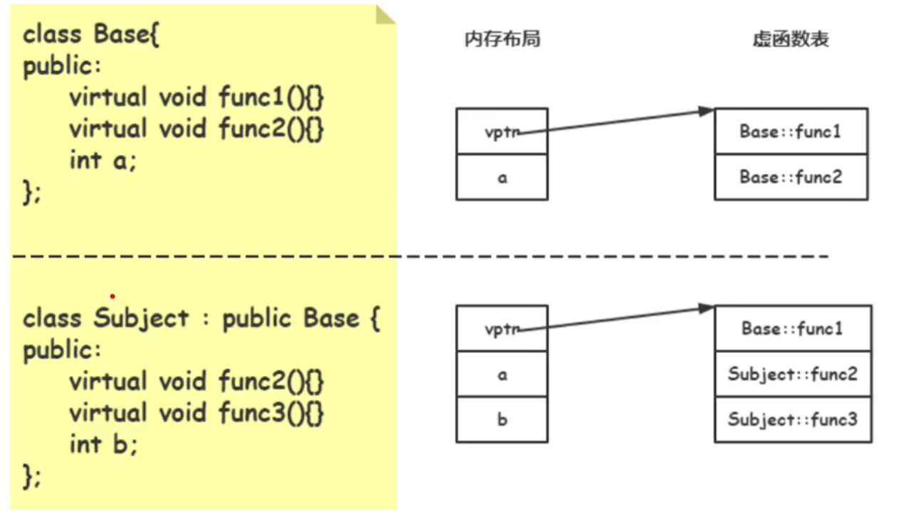

# 设计模式

设计模式是指在软件开发中，经过验证的，用于解决在特定环境下，重复出现的，特定问题的解决方案

## 设计原则

### 1. 依赖倒置

继承与组合

> 组合时使用Base类的指针更易扩展

> 继承中的虚函数覆盖

### 2. 开放封闭

> 一个类应该对扩展（组合和继承）开放，对修改关闭

### 3. 单一职责

> 一个类应该仅有一个引起它变化的原因

### 4. 里氏替换

> 子类型必须能够替换掉它的父类型；主要出现在子类覆盖父类实现，原本使用父类型的程序可能出现错误；覆盖了父类方法却没有实现父类方法的职责。

### 5. 接口隔离

> 严格分离public和private

## 模板方法

定义一个操作中的算法的骨架，而将一些步骤延迟到子类中。Template Method使得子类可以不改变一个算法的结构即可重定义该算法的某些特定步骤。
