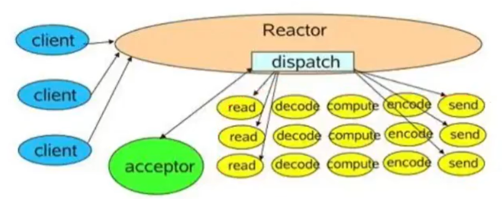
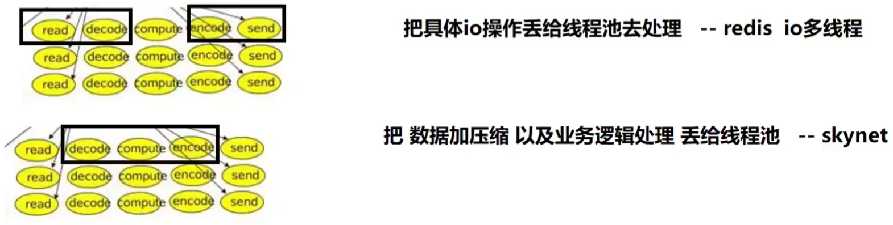
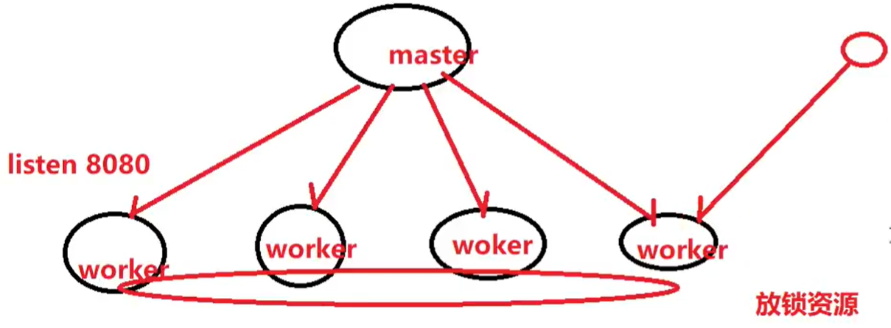

# IO模型

1. 阻塞io模型
2. 非阻塞io模型
3. io多路复用模型

## reactor

io多路复用+非阻塞io（检测+操作）

io多路复用：select，poll，epoll

reactor对事件进行网络编程，而非对每一个io进行处理。

* 单reactor - redis
* 多进程 reactor - nginx
* 多线程 reactor - memcached

### 单reactor

### 多进程reactor(nginx)

共享内存的进程锁机制来分配io操作

### 多线程reactor(memcached)

每个线程对应一个epoll对象，且都处理io操作
