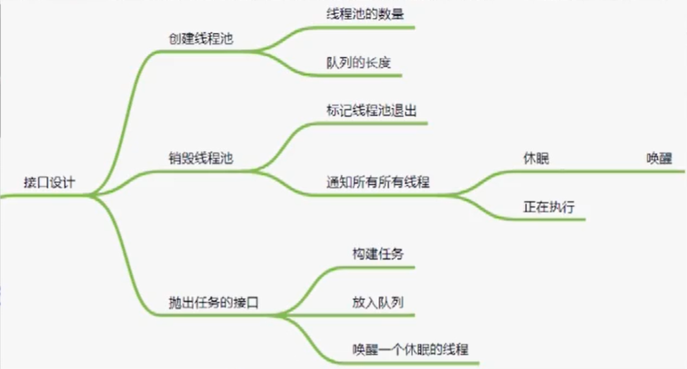
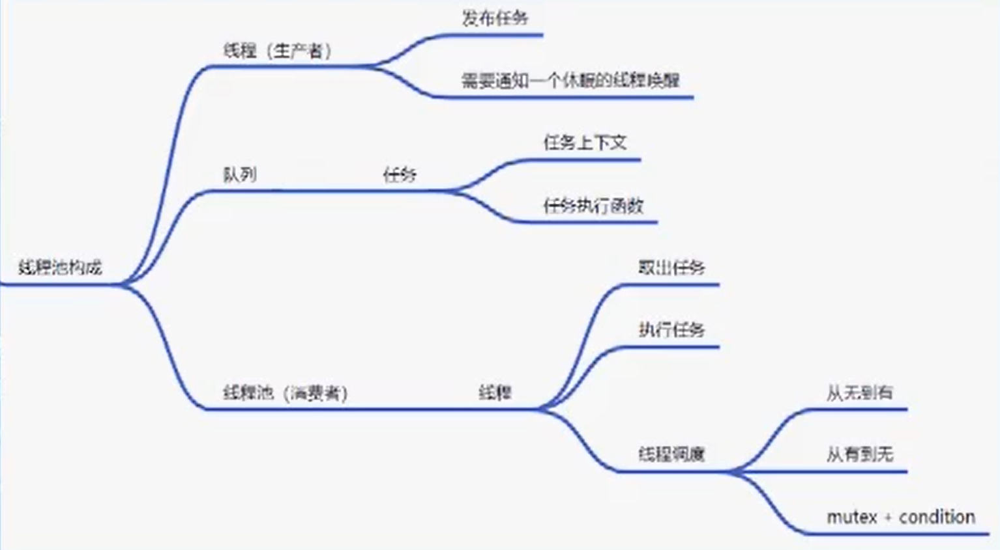

# 线程池

$\bf{前提:}$基类任务特别耗时，严重影响该线程处理其他任务

$\bf{异步执行}$:

1. 执行的上下文信息
2. 任务执行函数

$\bf{作用:}$

1. 复用线程资源
2. 充分利用系统资源
3. 异步执行耗时任务

$\bf{作用:}$

* CPU密集型: cpu核心数
* IO密集型: 2*cpu核心数+2
* 公式: (io等待时间+cpu运算时间) * 核心数 / cpu运算时间

$\bf{构成:}$

1. 线程(生产者): 发布任务/线程唤醒
2. 队列: 任务(任务上下文/任务执行函数)
3. 线程池(消费者): 线程(取出任务/执行任务/线程调度)

## Code

code: src/thread_pool/thrd_pool.h

code: src/thread_pool/thrd_pool.c/thread_pool_t  
线程调度code: src/thread_pool/thrd_pool.c/thread_worker

## 优化 ==> Redis/skynet 线程池
